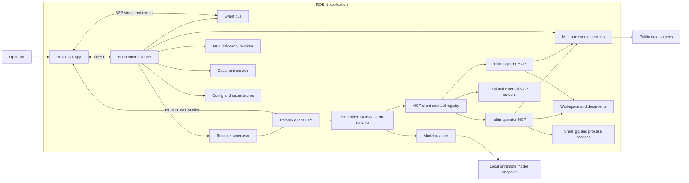
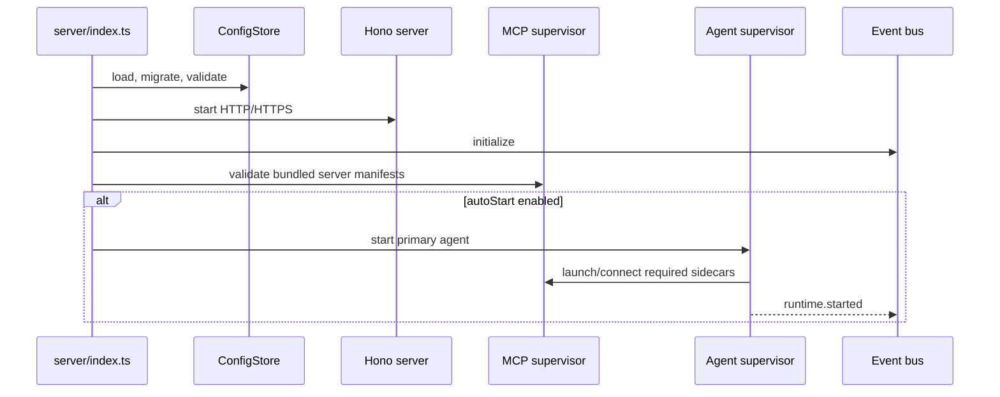
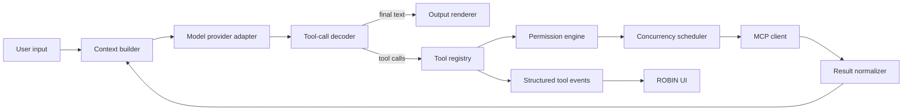
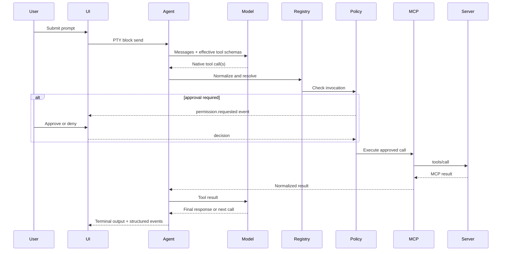

# ROBIN Final Application Architecture

**Status:** Target-state architecture and normative implementation contract  
**Date:** 2026-07-10  
**Repository:** `synthorganic/ROBIN`  
**Baseline reviewed:** `main` at `0f37e05bc42012b90423cf3451b7dabbb442ec36`  
**Primary decision:** MCP-first tool discovery and execution, modeled after the Atlas Code Explorer server/client pattern  

> **Important: Presence in Repository ≠ Active Architecture**
>
> This document describes the **active/target architecture**, not merely what exists in the codebase.
>
> - **Active architecture**: Terminal agent runtime (PTY) + MCP protocol for tool discovery/execution
> - **Legacy code**: May remain temporarily during migration but is NOT the active path
> - **UI dependency rule**: The frontend MUST NOT depend on legacy routes even if they exist

---

## 1. Authority and scope

This file is the canonical source of truth for the final ROBIN application architecture.

It supersedes architectural statements in:

- `PLAN.md`
- `plan_final.md`
- `CHECKLIST.md`
- the previous contents of `docs/ARCHITECTURE.md`
- stale OpenClaw, gateway, `App.tsx`, `AuthGate`, and message-session documentation elsewhere in the repository

Those files may remain temporarily as historical implementation notes, but they MUST NOT be used to resolve architectural ambiguity after this document is adopted.

The architecture defined here distinguishes three states:

- **Target:** required final behavior.
- **Transitional:** temporarily allowed while migrating (e.g., `/api/agent/session` routes during migration).
- **Legacy:** must be removed after its replacement is verified.

> **Critical: Terminal + MCP is the Active Architecture**
>
> The active ROBIN architecture consists of:
>
> 1. **Terminal agent runtime**: A supervised PTY process running the embedded ROBIN agent
> 2. **MCP (Model Context Protocol)**: The sole mechanism for tool discovery and execution
>
> Legacy patterns that are NOT active:
>
> - `/api/agent/session/*` routes (message-session backend) — may exist temporarily during migration
> - Gateway WebSocket proxying (`/ws`) — deprecated
> - Gateway RPC via `GatewayContext` — deprecated, throws error in MCP-first mode
> - Server-side agent loops (`server/lib/ops-agent.ts`) — deleted after PTY runtime verified
>
> **The UI MUST NOT depend on any legacy routes.** If a route exists but the UI does not call it, that is acceptable during migration. The active UI uses:
>
> - Terminal WebSocket at `/api/agent-terminal/ws` for all agent interaction
> - MCP tools (via `robin-explorer` and `robin-operator`) for domain operations
> - REST only for snapshots configuration, and human-driven operations

Normative words such as **MUST**, **SHOULD**, and **MAY** are intentional.

### 1.1 Canonical human and machine-readable source

The canonical human-readable file MUST be:

```text
docs/ARCHITECTURE.md
```

The bundled read-only MCP server MUST expose that exact file as:

```text
robin://architecture
```

The MCP resource MUST read the file at request time or through a cache invalidated by file modification time. It MUST NOT maintain a separately authored copy. That turns the architecture document into an actual source of truth rather than another document destined to become archaeology.

---

## 2. Executive summary

> **Active Architecture: Terminal Runtime + MCP**
>
> The current active architecture consists of:
>
> - **Terminal agent runtime**: One primary interactive ROBIN agent running in a supervised PTY (pseudo-terminal)
> - **MCP protocol**: The exclusive mechanism for tool discovery, invocation, and result handling
> - **No gateway dependency**: No OpenClaw compatibility layer, no WebSocket proxy, no Gateway RPC
>
> The UI is built around the TerminalAgent component which connects via WebSocket to `/api/agent-terminal/ws`. All agent interaction happens through this terminal interface. Chat history comes from PTY scrollback (10,000 lines), NOT from HTTP endpoints like `/api/agent/session/:id/history`.
>
> **Legacy routes may exist during migration** but are not active architecture:
> - `/api/agent/session/*` - message-session backend (deprecated)
> - `/ws` (WebSocket proxy) - gateway proxying (deprecated)
> - Gateway RPC via `GatewayContext` - throws error in MCP-first mode
>
> **Critical rule**: The UI MUST NOT depend on any deprecated routes. If a legacy route exists but the frontend doesn't call it, that is acceptable during migration.

ROBIN is a local-first operational intelligence application composed of:

1. A React operations interface centered on `OpsApp`.
2. A Hono control server that serves the UI, manages configuration and persistence, supervises processes, exposes domain APIs, and publishes structured events.
3. One primary interactive ROBIN agent runtime running in a supervised PTY.
4. A local or remote model endpoint used directly by the agent runtime.
5. An MCP-first capability plane used by the agent for workspace access, documents, map operations, shell/runtime operations, and optional external integrations.
6. Independent map ingestion and visualization services that continue operating whether or not the agent is running.

The final system MUST NOT depend on OpenClaw, a ROBIN Gateway v1 compatibility server, gateway WebSocket proxying, or a sibling Atlas repository at runtime.

The final system is **MCP-first, not MCP-only**:

- Domain capabilities MUST be discovered and invoked through MCP.
- A small number of runtime-internal controls MAY remain built into the agent, such as interrupt, permission prompting, MCP discovery, and session control.
- The browser and Hono server MAY call ordinary REST APIs for UI state and human-driven operations. REST is not a second agent tool protocol.

---

## 3. Architectural decisions

### ADR-001: `OpsApp` is the only application shell

`src/main.tsx` MUST mount `OpsApp` directly through the root error boundary. There MUST NOT be competing `App` and `OpsApp` shells.

Target mount path:

```text
ErrorBoundary -> StrictMode -> OpsApp
```

Authentication, when enabled, MUST be implemented as server middleware plus a small `OpsApp` gate or route-level state. It MUST NOT resurrect the retired context-heavy OpenClaw application shell.

### ADR-002: One primary agent runtime

ROBIN MUST run one canonical primary agent process per configured workspace. The primary process runs in a PTY and is the owner of:

- conversation state
- model requests
- model streaming
- tool-call loops
- MCP client connections
- permission checks
- tool result insertion
- user interrupts

Map command inputs, global prompt inputs, voice input, and the Agent tab MUST target this same process. They MUST NOT create shadow sessions or parallel message histories.

A support shell MAY exist, but it is not an agent and MUST NOT own model or tool state.

### ADR-003: The agent runtime owns the tool loop

The Hono server MUST NOT run a second LLM/tool loop in `server/lib/ops-agent.ts` or an equivalent service.

The server supervises the agent process and publishes status. The embedded agent runtime handles:

```text
model response -> normalized tool invocation -> permission -> MCP call -> result -> model continuation
```

This removes the current split-brain arrangement where a PTY agent, a server-side local agent, and a gateway can all believe they are the adult in the room.

### ADR-004: MCP is the primary capability plane

All agent-facing domain tools MUST be supplied by MCP servers or by MCP-wrapped ROBIN domain services.

The primary implementation pattern is the Atlas Code Explorer pattern:

- transport-independent `createServer()` factory
- explicit capabilities declaration
- `ListTools` and `CallTool` handlers
- resources and resource templates
- a local STDIO entrypoint
- an optional Streamable HTTP entrypoint
- strict root/path validation
- typed JSON schemas
- structured MCP content results

### ADR-005: Reuse the vendored agent MCP client

The MCP client inside `vendor/cli-agent/src/services/mcp/` MUST be the primary MCP client implementation after it is made reliably Node-compatible for ROBIN's build.

ROBIN MUST NOT maintain a separate general-purpose MCP client in `server/lib/tools/tool-mcp.ts`. That current class is transitional scaffolding and MUST be deleted or reduced to a thin test helper.

### ADR-006: Local MCP servers use STDIO by default

Bundled ROBIN MCP servers MUST use STDIO in the normal local deployment because it provides:

- process ownership by the agent runtime
- no open listening port
- automatic lifecycle coupling
- direct environment injection
- simpler trust boundaries

Streamable HTTP MAY be enabled for remote or multi-process deployments. SSE is compatibility-only and SHOULD NOT be chosen for new ROBIN servers.

### ADR-007: Hono is the control plane, not a gateway

The ROBIN Hono server owns:

- SPA serving
- authentication
- configuration
- process supervision
- terminal WebSocket upgrade handling
- structured event streaming
- map/data-source APIs
- document storage
- voice/TTS services
- human-facing administrative APIs

It MUST NOT translate model tool calls through `/tools/invoke`, emulate OpenClaw RPC, or proxy a gateway WebSocket.

### ADR-008: One structured configuration authority

The web control plane, CLI commands, and startup logic MUST read and write the same configuration store. There MUST NOT be independent UI state, environment state, gateway state, and agent state that silently diverge.

### ADR-009: Native tool calls are preferred; decoding is separate from execution

The model-facing call format and MCP execution transport are separate concerns.

The runtime MUST normalize any supported model response into a common `ToolInvocation` structure.

Preferred order:

1. Native OpenAI-compatible `tool_calls`.
2. Provider-specific structured function calls.
3. Optional strict text compatibility decoder for weak local models.

The compatibility decoder MAY remain available behind a config flag, but MCP remains the discovery and execution layer. Text-fenced calls MUST NOT be treated as the canonical tool protocol.

### ADR-010: Map operations remain independently available

The map MUST continue to load, refresh sources, render assets, and accept human interaction when the agent is stopped or unhealthy.

The agent accesses map capabilities through MCP. The browser accesses the map through REST and server events. Both surfaces delegate to the same domain services and stores.

### ADR-011: ROBIN owns all runtime paths

Final runtime state MUST live below `~/.robin/`. No final path or configuration key may default to `.openclaw`, a sibling Atlas checkout, or an unrelated user home working directory.

---

## 4. System context



### 4.1 Three architectural planes

#### Presentation and control plane

- React `OpsApp`
- Hono REST API
- terminal WebSocket
- SSE event stream
- configuration controls
- map visualization
- human approvals

#### Reasoning plane

- embedded ROBIN agent runtime
- model adapter
- conversation/context manager
- tool loop
- permission engine
- output renderer

#### Capability and data plane

- bundled MCP servers
- optional external MCP servers
- map source services
- document and workspace stores
- shell/git/process adapters

The boundaries are deliberate. UI code does not execute model tools. MCP servers do not render UI. The Hono server does not impersonate the agent runtime.

> **Active Architecture Clarification**
>
> The active architecture is defined by what the UI actively uses, not merely what exists in the repository:
>
> - **Presentation plane**: `TerminalAgent` component connects to `/api/agent-terminal/ws` for all agent interaction
> - **Reasoning plane**: Embedded ROBIN agent runtime handles tool loops, model calls, and MCP client operations
> - **Capability plane**: `robin-explorer` (read-only) and `robin-operator` (mutations) via MCP STDIO protocol
>
> Legacy routes may coexist during migration but are not part of the active architecture:
>
> | Pattern | Status | Active? |
> |---|---|---|
> | Terminal WebSocket `/api/agent-terminal/ws` | Target | Yes |
> | MCP tools (robin-explorer, robin-operator) | Target | Yes |
> | Gateway RPC (`GatewayContext.rpc()`) | Deprecated | No |
> | `/ws` proxy | Deprecated | No |
> | `/api/agent/session/*` | Legacy | No |
> | Server-side agent loop | Removed | No |

---

## 5. Runtime processes

### 5.1 Browser process

The browser owns presentation state only:

- active tab and panel layout
- map viewport and filters
- selected asset
- terminal dimensions and focus
- temporary form state
- cached snapshots returned by the server

The browser MUST NOT contain authoritative agent history, MCP configuration, or tool permissions that cannot be reconstructed from the server/runtime.

### 5.2 ROBIN Hono server

The server is the lifecycle owner for the local application. It MUST:

- validate config before starting child processes
- start the primary agent when `autoStart` is enabled
- start bundled MCP sidecars when required
- monitor process health
- terminate child processes during shutdown
- persist structured config changes atomically
- publish runtime and tool lifecycle events
- continue serving map and document APIs independently of agent state

### 5.3 Primary agent process

The primary agent process is a vendored, ROBIN-branded Node-compatible CLI runtime. It MUST:

- start in the configured workspace
- use the configured model endpoint and model
- load effective MCP configuration
- connect to required MCP servers
- discover tools and resources
- expose MCP connection health to the supervisor
- run the interactive model/tool loop
- render output to stdout/stderr for PTY capture
- emit structured runtime events through an IPC/event bridge where available

The runtime MUST NOT require the sibling `synthorganic/Atlas-Code` repository.

### 5.4 Bundled MCP sidecars

Bundled servers are child processes started by the agent runtime or MCP supervisor. Each server MUST be transport-independent at its core and have a small transport entrypoint.

Local default:

```text
agent runtime -> StdioClientTransport -> bundled MCP server
```

Remote optional:

```text
agent runtime -> StreamableHTTPClientTransport -> approved remote MCP server
```

### 5.5 Model endpoint

The model endpoint MAY be:

- LM Studio
- llama.cpp server
- vLLM
- another OpenAI-compatible local endpoint
- an explicitly configured remote provider adapter

The agent runtime talks to the model endpoint directly. The Hono server MAY list models and test connectivity, but MUST NOT proxy normal completion traffic unless a later deployment mode explicitly requires it.

---

## 6. Target repository structure

```text
ROBIN/
├── docs/
│   ├── ARCHITECTURE.md                 # this document; canonical
│   ├── API.md
│   └── operations/
│       ├── MCP.md
│       ├── RUNTIME.md
│       └── MAP.md
│
├── src/
│   ├── main.tsx
│   ├── components/
│   ├── features/
│   │   ├── ops/
│   │   │   ├── OpsApp.tsx
│   │   │   ├── shell/
│   │   │   ├── status/
│   │   │   └── api/
│   │   ├── agent/
│   │   │   ├── AgentWorkspace.tsx
│   │   │   ├── AgentTerminal.tsx
│   │   │   ├── AgentControlRail.tsx
│   │   │   ├── ToolActivity.tsx
│   │   │   └── useAgentRuntime.ts
│   │   ├── map/
│   │   │   ├── MapWorkspace.tsx
│   │   │   ├── LeafletMap.tsx
│   │   │   ├── sourceVisuals.tsx
│   │   │   ├── renderingPolicy.ts
│   │   │   └── useMapSnapshot.ts
│   │   ├── documents/
│   │   ├── settings/
│   │   ├── voice/
│   │   └── tts/
│   ├── hooks/
│   └── lib/
│       ├── api-client.ts
│       ├── events.ts
│       └── types.ts
│
├── server/
│   ├── index.ts
│   ├── app.ts
│   ├── routes/
│   │   ├── health.ts
│   │   ├── events.ts
│   │   ├── runtime.ts
│   │   ├── agent-config.ts
│   │   ├── agent-models.ts
│   │   ├── terminals.ts
│   │   ├── map.ts
│   │   ├── documents.ts
│   │   ├── mcp.ts
│   │   ├── tts.ts
│   │   └── transcribe.ts
│   └── lib/
│       ├── runtime/
│       │   ├── supervisor.ts
│       │   ├── launch-spec.ts
│       │   ├── terminal-session.ts
│       │   └── status.ts
│       ├── mcp/
│       │   ├── supervisor.ts
│       │   ├── config-store.ts
│       │   ├── catalog-cache.ts
│       │   └── health.ts
│       ├── config/
│       │   ├── schema.ts
│       │   ├── store.ts
│       │   └── migration.ts
│       ├── map/
│       ├── documents/
│       └── events/
│
├── mcp/
│   ├── shared/
│   │   ├── result.ts
│   │   ├── errors.ts
│   │   ├── roots.ts
│   │   └── validation.ts
│   ├── robin-explorer/
│   │   ├── src/server.ts               # transport-independent factory
│   │   ├── src/index.ts                # STDIO entrypoint
│   │   ├── src/http.ts                 # optional Streamable HTTP entrypoint
│   │   ├── src/tools/
│   │   └── src/resources/
│   └── robin-operator/
│       ├── src/server.ts
│       ├── src/index.ts
│       ├── src/http.ts
│       └── src/tools/
│
├── vendor/
│   └── cli-agent/
│       ├── src/services/mcp/            # primary MCP client
│       ├── src/robin/                    # ROBIN bootstrap/adapters
│       └── ...
│
└── scripts/
    ├── embedded-cli.mjs
    ├── test-mcp-roundtrip.mjs
    └── migrate-robin-config.mjs
```

Exact filenames MAY evolve, but ownership boundaries MUST remain.

---

## 7. Frontend architecture

### 7.1 Root composition

`src/main.tsx` MUST mount one shell:

```tsx
createRoot(root).render(
  <ErrorBoundary>
    <StrictMode>
      <OpsApp />
    </StrictMode>
  </ErrorBoundary>,
)
```

No gateway provider, chat provider, or session provider is required for the final Ops path.

### 7.2 `OpsApp` decomposition

The current large `OpsApp.tsx` SHOULD be decomposed into domain modules while retaining one shell:

```text
OpsApp
├── OpsHeader
├── OpsNavigation
├── MapWorkspace
├── StatusWorkspace
├── AgentWorkspace
├── GlobalPromptProxy
└── GlobalErrorRegion
```

`OpsApp` owns navigation and shell layout. It MUST NOT implement model loops, Leaflet internals, source registries, or terminal protocol parsing inline.

### 7.3 Agent workspace

The Agent tab MUST contain:

- the primary xterm terminal
- start, stop, restart, and interrupt controls
- current model and endpoint status
- enabled MCP profile and server health
- recent structured tool activity
- document context controls
- runtime logs and restart reason

The terminal is the canonical textual interaction surface. Structured tool cards are projections of runtime events, not a second message history.

### 7.4 Prompt proxy surfaces

The following surfaces MAY submit prompts:

- Agent tab command line
- global `Ask ROBIN` input
- map command deck
- voice input
- selected asset `Send to ROBIN`

All MUST call one block-send API associated with the primary terminal/runtime. A prompt submission MAY switch focus to the Agent tab but MUST NOT spawn a new agent process.

### 7.5 Terminal transport

The final transport split is:

- **WebSocket:** bidirectional PTY bytes and terminal control messages.
- **SSE:** structured application events such as runtime status, MCP health, tool lifecycle, map updates, and config changes.
- **REST:** snapshots, configuration writes, CRUD, and explicit lifecycle commands.

Terminal control frames MUST use a typed envelope and raw terminal data MUST be distinguishable from JSON control frames.

Example control frames:

```ts
type TerminalClientControl =
  | { type: 'resize'; cols: number; rows: number }
  | { type: 'ping' }
  | { type: 'interrupt' };

type TerminalServerControl =
  | { type: 'connected'; sessionId: string; resumed: boolean }
  | { type: 'pong' }
  | { type: 'exit'; exitCode: number | null; signal?: number }
  | { type: 'error'; code: string; message: string };
```

### 7.6 Frontend state ownership

Use local React state for ephemeral presentation state and small focused hooks for server-backed state.

Recommended hooks:

- `useAgentRuntime()`
- `useMcpStatus()`
- `useToolActivity()`
- `useMapSnapshot()`
- `useDocuments()`
- `useServerEvents()`

The final architecture SHOULD avoid replacing the old context forest with a new context forest wearing a fake mustache.

---

## 8. Backend control plane

### 8.1 Server startup sequence



The server MUST NOT auto-start or probe a gateway.

### 8.2 Runtime supervisor

One runtime supervisor MUST replace the overlapping responsibilities currently spread across terminal managers and agent-terminal routes.

It owns:

- one primary agent PTY
- optional support shell PTY
- process launch specifications
- restart locks
- scrollback buffer
- workspace changes
- environment construction
- process exit handling
- runtime status
- block-send and interrupt
- graceful shutdown

There MUST NOT be two unrelated PTY session managers for the same agent.

### 8.3 MCP supervisor

The MCP supervisor owns process-level concerns outside the agent library:

- verifying bundled MCP server build artifacts
- generating effective MCP config
- validating executable paths
- collecting sidecar health
- restarting sidecars when their config changes
- exposing status to the UI

The agent runtime remains the MCP protocol client and owns protocol sessions.

### 8.4 Config store

Configuration writes MUST be:

- schema validated
- atomic
- versioned
- serialized by a mutex
- emitted as a structured event
- classified as hot-applied or restart-required

A config write that requires restart MUST produce a controlled restart reason visible in the UI.

### 8.5 Domain services

Domain services such as maps and documents SHOULD be ordinary TypeScript services with shared methods used by both REST routes and MCP tool handlers.

Example:

```text
REST POST /api/map/assets ----\
                                -> MapAssetService.create()
MCP map_create_asset ---------/
```

MCP handlers MUST NOT call the application's own REST endpoint over localhost when they can import or invoke the same domain service directly. Internal HTTP pinball is not an architecture.

---

## 9. Agent runtime architecture

### 9.1 Internal pipeline



### 9.2 Model provider adapter

The model adapter MUST provide a provider-neutral completion contract.

```ts
interface ModelRequest {
  model: string;
  messages: RuntimeMessage[];
  tools: ModelToolDefinition[];
  temperature?: number;
  maxTokens?: number;
  stream: boolean;
  signal?: AbortSignal;
}

interface ModelResponse {
  text: string;
  reasoning?: string;
  toolCalls: ProviderToolCall[];
  finishReason: 'stop' | 'length' | 'tool_calls' | 'error';
  usage?: TokenUsage;
}
```

### 9.3 Tool-call decoder

Provider-specific output MUST be normalized before registry resolution.

```ts
interface ToolInvocation {
  id: string;
  requestedName: string;
  arguments: Record<string, unknown>;
  provider: string;
  raw?: unknown;
}
```

A compatibility text decoder MUST output the same structure and MUST NOT directly execute tools.

### 9.4 Tool registry

The effective registry is the union of:

- runtime-internal control tools
- enabled bundled MCP tools
- enabled external MCP tools
- deferred tools discoverable through MCP tool search

Each entry MUST include:

```ts
interface EffectiveToolDefinition {
  canonicalName: string;
  displayName: string;
  serverId: string | 'runtime';
  remoteName: string;
  description: string;
  inputSchema: Record<string, unknown>;
  annotations: {
    readOnly: boolean;
    destructive: boolean;
    idempotent: boolean;
    openWorld: boolean;
    concurrencySafe: boolean;
  };
  profileTags: string[];
}
```

### 9.5 Stable tool naming

Model-facing names MUST be deterministic and collision-safe.

Recommended canonical format:

```text
mcp__<normalized-server-id>__<normalized-tool-name>
```

Example:

```text
mcp__robin_explorer__search_workspace
mcp__robin_operator__map_create_asset
```

The runtime MAY present shorter aliases when unambiguous, but stored history and events MUST preserve the canonical name and server ID.

### 9.6 Permission engine

Every call MUST pass through one permission decision point before execution.

Permission decisions are based on:

- tool annotations
- active tool profile
- workspace roots
- command/path arguments
- configured allow/deny rules
- user approval state
- remote server trust status

Permission results:

```ts
type PermissionDecision =
  | { decision: 'allow'; rule: string }
  | { decision: 'deny'; reason: string }
  | { decision: 'prompt'; promptId: string; summary: string };
```

### 9.7 Concurrency scheduler

Calls MUST default to serial execution unless all calls in a batch explicitly declare themselves concurrency-safe and have no dependency relationship.

Writes to the same domain or root SHOULD be serialized by keyed mutexes.

### 9.8 Cancellation

Each model turn and tool call MUST have an `AbortController`. Ctrl+C, UI interrupt, runtime restart, or connection loss MUST propagate cancellation through:

```text
UI -> runtime supervisor -> agent turn -> MCP client -> MCP server handler
```

### 9.9 Result normalization

All tool results MUST normalize into MCP-compatible content plus runtime metadata.

```ts
interface NormalizedToolResult {
  invocationId: string;
  serverId: string;
  toolName: string;
  ok: boolean;
  content: Array<
    | { type: 'text'; text: string }
    | { type: 'image'; mimeType: string; dataRef: string }
    | { type: 'resource'; uri: string; mimeType?: string }
  >;
  error?: { code: string; message: string; retryable: boolean };
  durationMs: number;
  truncated: boolean;
  storedOutputRef?: string;
}
```

Large results MUST be truncated using deterministic limits and persisted to a ROBIN-owned output store when the full result may be needed later.

---

## 10. MCP capability architecture

### 10.1 Bundled server pattern

Each bundled server MUST follow this structure:

```ts
export function createServer(deps: ServerDependencies): Server {
  const server = new Server(
    { name: deps.serverName, version: deps.version },
    { capabilities: { tools: {}, resources: {}, prompts: {} } },
  );

  registerTools(server, deps);
  registerResources(server, deps);
  registerPrompts(server, deps);
  return server;
}
```

Transport entrypoints remain tiny:

```ts
const server = createServer(deps);
await server.connect(new StdioServerTransport());
```

### 10.2 `robin-explorer`

`robin-explorer` is enabled by default and is read-only.

Required tool groups:

#### Workspace exploration

- `list_workspace`
- `read_workspace_file`
- `search_workspace`
- `stat_workspace_path`
- `list_project_documents`
- `read_project_document`

#### Architecture and code orientation

- `get_architecture`
- `list_source_modules`
- `get_source_module`
- `search_source`

#### Map observation

- `map_get_snapshot`
- `map_search_assets`
- `map_get_asset`
- `map_get_source_status`
- `map_get_view_context`

#### Runtime observation

- `runtime_get_status`
- `runtime_get_recent_events`
- `mcp_get_status`

Required resources:

- `robin://architecture`
- `robin://config/public`
- `robin://workspace/tree`
- `robin://documents/index`
- `robin://map/snapshot`
- `robin://mcp/catalog`
- `robin://source/{path}`
- `robin://document/{id}`

The explorer server MUST enforce configured roots and MUST reject path traversal after canonical path resolution.

### 10.3 `robin-operator`

`robin-operator` is permission-gated and may be disabled by profile.

Required tool groups:

#### Workspace mutation

- `write_workspace_file`
- `edit_workspace_file`
- `move_workspace_path`
- `trash_workspace_path`

#### Shell and development

- `run_command`
- `run_powershell`
- `git_status`
- `git_diff`
- `git_apply_patch`

#### Map mutation

- `map_create_asset`
- `map_update_asset`
- `map_delete_asset`
- `map_refresh_sources`
- `map_save_point_of_interest`

#### Documents

- `document_import`
- `document_delete`
- `document_extract_text`

#### Runtime and configuration

- `runtime_restart`
- `config_update_nonsecret`

Secret writes SHOULD remain a human-facing UI/API operation rather than a model tool.

### 10.4 Optional external MCP servers

External servers MAY be configured for GitHub, web research, databases, sensors, or other integrations.

They MUST be:

- explicitly configured
- assigned a stable server ID
- assigned to one or more tool profiles
- health checked
- namespaced
- subject to the same permission engine

### 10.5 MCP configuration discovery

Effective configuration order, highest precedence first:

1. Session/runtime override generated by ROBIN.
2. Workspace `.robin/mcp.json`.
3. User `~/.robin/mcp.json`.
4. Bundled defaults.

A server disabled at a higher-precedence scope remains disabled.

### 10.6 Example MCP configuration

```json
{
  "version": 1,
  "servers": {
    "robin-explorer": {
      "transport": "stdio",
      "command": "node",
      "args": ["mcp/robin-explorer/dist/index.js"],
      "env": {
        "ROBIN_WORKSPACE_ROOT": "${workspace}",
        "ROBIN_DOCUMENT_ROOT": "${documents}",
        "ROBIN_ARCHITECTURE_FILE": "${repo}/docs/ARCHITECTURE.md"
      },
      "required": true,
      "enabledProfiles": ["observe", "operate", "develop"]
    },
    "robin-operator": {
      "transport": "stdio",
      "command": "node",
      "args": ["mcp/robin-operator/dist/index.js"],
      "env": {
        "ROBIN_WORKSPACE_ROOT": "${workspace}",
        "ROBIN_DOCUMENT_ROOT": "${documents}"
      },
      "required": false,
      "enabledProfiles": ["operate", "develop"]
    }
  }
}
```

Runtime interpolation MUST use an allowlisted variable set. Arbitrary shell interpolation is forbidden.

### 10.7 Tool profiles

The final bundled profiles are:

| Profile | Purpose | Default capabilities |
|---|---|---|
| `observe` | Analysis and situational awareness | read-only workspace, documents, map, architecture |
| `operate` | Normal ROBIN operations | observe + map/document mutations |
| `develop` | Code and runtime maintenance | operate + file writes, git, shell |
| `custom` | Explicit operator-defined set | exact configured tools/servers |

`observe` SHOULD be the default first-run profile.

---

## 11. Tool-call lifecycle



### 11.1 Structured lifecycle events

For each invocation, the runtime SHOULD emit:

- `tool.requested`
- `tool.permission_requested`
- `tool.started`
- `tool.progress`
- `tool.completed`
- `tool.failed`
- `tool.cancelled`

This permits clean UI rendering without parsing ANSI terminal output to infer what happened.

---

## 12. Configuration model

### 12.1 Agent configuration

```ts
interface OpsAgentConfig {
  version: number;
  workspacePath: string;
  autoStart: boolean;
  model: {
    provider: 'openai-compatible' | 'custom';
    baseUrl: string;
    modelId: string;
    apiKeyRef?: string;
    temperature: number;
    maxTokens?: number;
    nativeToolCalls: 'required' | 'preferred' | 'disabled';
    allowTextToolFallback: boolean;
  };
  runtime: {
    primaryTerminalId: 'primary';
    restartOnConfigChange: boolean;
    scrollbackBytes: number;
    maxToolIterations: number;
  };
  mcp: {
    activeProfile: 'observe' | 'operate' | 'develop' | 'custom';
    requiredServers: string[];
    disabledServers: string[];
    customAllowedTools: string[];
    toolTimeoutMs: number;
  };
  documents: {
    root: string;
  };
  map: {
    autoRefresh: boolean;
    defaultRefreshSeconds: number;
  };
}
```

### 12.2 Runtime status

```ts
interface OpsAgentRuntimeStatus {
  state: 'stopped' | 'starting' | 'ready' | 'busy' | 'stopping' | 'error';
  pid: number | null;
  terminalSessionId: string | null;
  workspacePath: string;
  activeModel: string;
  activeProfile: string;
  startedAt?: string;
  lastActivityAt?: string;
  configVersion: number;
  restartRequired: boolean;
  restartReason?: string;
  mcp: Record<string, {
    state: 'disconnected' | 'connecting' | 'ready' | 'needs-auth' | 'error';
    toolCount: number;
    resourceCount: number;
    lastError?: string;
  }>;
}
```

### 12.3 Config application classes

| Change | Application |
|---|---|
| UI-only preference | immediate, no runtime action |
| temperature/max tokens | next turn |
| tool profile | refresh registry; restart only if client cannot reload safely |
| model ID | next turn or controlled restart |
| model base URL/provider | controlled restart |
| workspace root | controlled restart |
| MCP command/transport/env | sidecar and agent MCP reconnect |
| secret value | update secret store; reconnect affected service |

---

## 13. Persistence layout

Canonical final layout:

```text
~/.robin/
├── config.json
├── mcp.json
├── secrets.env                       # transitional; replaceable by keychain adapter
├── runtime/
│   ├── status.json
│   ├── outputs/
│   └── logs/
├── workspaces/
│   └── <workspace-id>/
│       ├── metadata.json
│       └── memory/
├── documents/
│   └── <project>/
├── map/
│   ├── map-assets.json
│   └── source-cache/
├── events/
│   └── recent.jsonl
└── migrations/
    └── state.json
```

Existing `~/.robin/inertiai-ops/` data MUST be migrated or read through a compatibility migration. New writes SHOULD use the canonical final layout after migration.

File-backed stores are acceptable for the final initial release. Service interfaces MUST make a later SQLite migration possible without changing UI or MCP contracts.

---

## 14. Final public API

### 14.1 Runtime

| Method | Route | Purpose |
|---|---|---|
| GET | `/api/runtime/status` | Full runtime and MCP health snapshot |
| POST | `/api/runtime/start` | Start primary agent |
| POST | `/api/runtime/stop` | Stop primary agent |
| POST | `/api/runtime/restart` | Controlled restart with reason |
| POST | `/api/runtime/interrupt` | Interrupt active turn/tool call |
| GET | `/api/runtime/logs` | Recent structured runtime logs |

### 14.2 Configuration and models

| Method | Route | Purpose |
|---|---|---|
| GET | `/api/agent/config` | Read effective public config |
| PUT | `/api/agent/config` | Validate and update config |
| POST | `/api/agent/models` | List/test models at configured endpoint |
| GET | `/api/mcp/servers` | MCP server configuration and status |
| PUT | `/api/mcp/servers/:id` | Update an MCP server config |
| POST | `/api/mcp/servers/:id/reconnect` | Reconnect one server |
| GET | `/api/mcp/catalog` | Effective tool/resource catalog |

### 14.3 Terminal

| Transport | Route | Purpose |
|---|---|---|
| WebSocket | `/api/agent-terminal/ws` | PTY input/output and control |
| POST | `/api/terminals/primary/block` | Submit a newline-terminated prompt block |
| GET | `/api/terminals/primary/scrollback` | Rehydrate terminal after reconnect |

### 14.4 Events

| Method | Route | Purpose |
|---|---|---|
| GET | `/api/events` | SSE stream for structured application events |

### 14.5 Domain APIs retained

- map assets, sources, overlays, and refresh
- documents upload/list/delete/read metadata
- TTS and transcription
- health and version
- explicitly retained settings and diagnostics

### 14.6 Deprecated routes (to remove)

> **Important: Presence in Repository ≠ Active Architecture**
>
> Legacy routes like `/api/agent/session/*` may exist temporarily during migration but are **NOT** part of the active architecture. The UI MUST NOT depend on them.

After migration, remove:

| Route | Reason |
|---|---|
| `/api/agent/session*` | Belongs to deprecated message-session backend; history now from terminal scrollback |
| `/api/bridge*` | Legacy bridge to OpenClaw gateway |
| `/api/shared-chat*` | Legacy shared chat implementation |
| `/api/gateway*` | Gateway v1 compatibility routes; replaced by MCP |
| `/api/connect-defaults` | Server-side gateway config now uses MCP supervisor |
| `/ws` (WebSocket proxy) | Deprecated; use direct agent-terminal WebSocket at `/api/agent-terminal/ws` |
| `/tools/invoke` | Gateway RPC emulation; replaced by MCP tools |

**Active UI pattern:**
- Terminal interaction: `/api/agent-terminal/ws` (PTY WebSocket)
- Domain operations: `robin-explorer` and `robin-operator` MCP servers
- REST only for: snapshots, configuration writes, human-driven operations

Human administrative shell access, if retained, MUST be clearly separated from agent tools.

---

## 15. Event contract

All structured events MUST use one envelope:

```ts
interface RobinEvent<T = unknown> {
  id: string;
  type: string;
  ts: number;
  source: 'server' | 'runtime' | 'mcp' | 'map' | 'documents' | 'ui';
  correlationId?: string;
  data: T;
}
```

Required event families:

```text
runtime.status
runtime.started
runtime.stopped
runtime.restart_required
runtime.error

mcp.server_status
mcp.catalog_updated
mcp.auth_required

tool.requested
tool.permission_requested
tool.started
tool.progress
tool.completed
tool.failed
tool.cancelled

config.updated
documents.updated
map.updated
map.source_status
```

SSE reconnect MUST support a bounded recent-event replay or a snapshot refresh strategy.

---

## 16. Map architecture

### 16.1 Domain pipeline

```text
source adapters -> normalization -> source cache -> snapshot service -> REST/MCP -> Leaflet rendering
manual assets ---------------------> map asset store -----^
```

The map domain service owns the canonical `MapAsset` representation. UI and MCP handlers use the same service.

### 16.2 Source visual registry

One registry MUST define each source's:

- source ID
- group
- label
- sidebar icon component
- map SVG path or rendered SVG
- color token
- priority
- clustering policy
- minimum individual zoom

The sidebar, legend, individual markers, and cluster summaries MUST consume the same registry.

### 16.3 Rendering policy

Recommended target policy:

| Zoom | Rendering |
|---:|---|
| 0-5 | aggregate/cluster logistics, transport, and open-source points |
| 6-8 | cluster dense sources; show critical, warning, selected, manual, and aircraft individually |
| 9+ | show individual markers subject to density limits |

Critical, warning, selected, and operator-saved markers MUST remain above ordinary clusters.

Marker sizing MUST use clamped zoom buckets, not unconstrained viewport multiplication.

### 16.4 Performance

- `preferCanvas` remains enabled for compatible vector layers.
- DOM marker count SHOULD remain bounded through clustering.
- Selection MUST NOT clear and recreate every marker.
- Icon updates SHOULD occur only when zoom bucket or source visual state changes.
- Rapid zoom and pan MUST not cause synchronous full-list layout thrashing.

### 16.5 Agent map tools

Read tools live in `robin-explorer`; mutations live in `robin-operator`.

The model never receives direct store paths. It receives typed map records and stable asset IDs.

---

## 17. Documents and workspace roots

### 17.1 Root model

The runtime MUST have explicit roots:

- workspace root
- document root
- optional read-only repository root
- optional output root

Every filesystem MCP handler MUST resolve and canonicalize a requested path, then verify it remains within an allowed root.

Prefix string comparison without separator/case normalization is insufficient on Windows.

### 17.2 Document ingestion

Uploaded documents MUST be stored as ordinary files under the document root and indexed with metadata.

MCP tools SHOULD expose:

- list
- metadata
- text extraction
- bounded reading
- URI resources

Document parsing SHOULD be implemented in Node where practical. PowerShell may be a platform fallback, not the canonical parser contract.

---

## 18. Permissions and trust boundaries

### 18.1 Capability classes

| Class | Examples | Default |
|---|---|---|
| read-local | file read, search, map snapshot | allow in `observe` |
| mutate-local | file edit, map asset mutation | prompt or profile rule |
| execute-local | shell, PowerShell, git mutation | prompt |
| network-read | approved APIs, external MCP reads | profile rule |
| network-write | remote mutations | prompt |
| secret/config | API key changes | human UI only by default |

### 18.2 Remote MCP trust

Remote MCP servers MUST be visibly identified in approvals and tool activity. A remote server MUST NOT silently inherit local filesystem roots or secrets.

### 18.3 Audit record

Each tool completion MUST log:

- invocation ID
- canonical tool name
- server ID
- sanitized arguments summary
- permission rule/decision
- start and end times
- result status
- output reference when persisted

Logs MUST avoid storing raw secret values.

---

## 19. Observability and diagnostics

The runtime status surface MUST expose:

- agent process state and PID
- active model and endpoint health
- MCP server states
- discovered tool/resource counts
- current turn state
- restart-required state
- last error
- recent tool durations
- event stream health

A diagnostics command or endpoint SHOULD perform:

1. config validation
2. workspace access check
3. model endpoint health and model listing
4. bundled MCP build check
5. MCP connect/list-tools roundtrip
6. architecture resource read
7. document root read/write check
8. map service snapshot check

---

## 20. Current file disposition

| Current path | Final disposition |
|---|---|
| `src/main.tsx` | Keep direct `OpsApp` mount; remove stale shell assumptions |
| `src/features/ops/OpsApp.tsx` | Keep as shell; split agent/map/status domains into modules |
| `src/features/ops/LeafletMap.tsx` | Keep and refactor around cluster groups, rendering policy, and shared visual registry |
| `src/features/ops/sourceVisuals.tsx` | Replace partial registry with canonical source visual registry |
| `src/features/agent-terminal/TerminalAgent.tsx` | Keep concept; rename/move into agent feature and bind to canonical supervisor |
| `server/app.ts` | Keep Hono composition; remove legacy route mounts and add runtime/MCP routes |
| `server/index.ts` | Keep server bootstrap; remove gateway auto-start/probe/proxy and start runtime supervisor |
| `server/lib/ops-terminals.ts` | Preferred base for canonical runtime supervisor; remove Codex/Atlas ambiguity and formalize primary agent |
| `server/routes/agent-terminal.ts` | Merge useful WebSocket/resume behavior into canonical terminal routes; delete duplicate manager |
| `server/lib/terminal-session-manager.ts` | Merge into canonical supervisor or delete after consolidation |
| `server/lib/ops-agent.ts` | Delete server-side model/tool loop after PTY runtime is verified |
| `server/routes/ops-agent.ts` | Replace message-session routes with config/status routes or delete |
| `server/lib/lmstudio-service.ts` | Retain only shared model discovery/health if useful; no duplicate completion loop |
| `server/lib/gateway-v1.ts` | Delete after MCP roundtrip and domain tools replace it |
| `server/lib/gateway-files.ts` | Move needed logic into MCP domain services; delete gateway wrapper |
| `server/lib/gateway-execution.ts` | Move execution behind operator MCP tools; delete gateway wrapper |
| `server/lib/tools/tool-mcp.ts` | Delete null-result stub; do not expand it into a competing client |
| `server/lib/ops-agent-tool-catalog.ts` | Replace static source scraping with live MCP catalog endpoint |
| `server/lib/ws-proxy.ts` | Delete after OpenClaw/gateway removal |
| `src/contexts/GatewayContext.tsx` | Delete from final Ops path |
| `src/contexts/SessionContext.tsx` | Delete gateway session responsibilities; retain only if repurposed and renamed for runtime state |
| `src/features/chat/` | Remove from final primary path; reusable markdown/tool cards may be relocated |
| `vendor/cli-agent/src/services/mcp/` | Keep as primary MCP client; make Node-compatible and ROBIN-owned in behavior |
| `vendor/cli-agent/src/robin/` | Keep and finish ROBIN bootstrap; remove gateway mappings |
| `PLAN.md`, `plan_final.md`, `CHECKLIST.md` | Archive or mark superseded after this file is adopted |

---

## 21. Migration plan

### Phase 0: Adopt the contract

- Replace `docs/ARCHITECTURE.md` with this document.
- Add a header to old plan/checklist files pointing here.
- Freeze new gateway compatibility work except fixes required to complete migration.

**Exit:** Architectural questions resolve against this file.

### Phase 1: Build bundled MCP servers

- Create `mcp/robin-explorer` using the transport-independent server factory.
- Expose `robin://architecture` from this document.
- Implement read-only workspace, documents, map, and runtime observation tools.
- Add STDIO roundtrip tests.
- Create `robin-operator` with permission metadata and a minimal mutation set.

**Exit:** A standalone test client can connect, list tools/resources, read architecture, and call representative read/write tools.

### Phase 2: Make the agent runtime MCP-primary

- Configure the vendored client to launch bundled sidecars.
- Replace static gateway tool prompts with live MCP tool definitions.
- Normalize native tool calls into the common invocation type.
- Route all domain tool calls through MCP.
- Emit structured tool lifecycle events.

**Exit:** A model can inspect a workspace file, query the map, and perform an approved mutation without `/tools/invoke`.

### Phase 3: Consolidate the agent process and terminal

- Choose one PTY/session supervisor.
- Launch the vendored ROBIN agent, not a generic shell, as the primary process.
- Wire block-send, resume, interrupt, and scrollback.
- Ensure config changes produce controlled reconnect/restart behavior.

**Exit:** All prompt surfaces target one interactive agent process and survive browser reconnect.

### Phase 4: Remove the server-side agent/gateway stack

- Remove `ops-agent` message sessions.
- Remove bridge/shared-chat paths.
- Remove gateway auto-start, health probe, RPC, WebSocket proxy, and v1 execution routes.
- Remove gateway-specific config and environment mappings.

**Exit:** Repository search and mounted-route tests find no active OpenClaw/gateway dependencies.

### Phase 5: Frontend consolidation

- Keep direct `OpsApp` entry.
- Integrate the canonical terminal and control rail.
- Remove transport toggle and duplicate chat history.
- Render tool activity from structured events.
- Split the monolithic `OpsApp` into domain modules.

**Exit:** Agent, map, and status views share one shell and one runtime state source.

### Phase 6: Map rendering cleanup

- Complete source visual registry.
- Add cluster layers and zoom thresholds.
- Fix marker scaling, selection updates, and pane priority.
- Replace placeholder tests with Leaflet mocks and behavior assertions.

**Exit:** Dense 600+ item views remain legible and responsive, and sidebar/map icon parity is exact.

### Phase 7: Documentation and deletion pass

- Update API docs.
- Archive superseded plans.
- Remove unused dependencies, generated JS duplicates, stale routes, and dead frontend modules.
- Add architecture drift checks where practical.

**Exit:** Build, tests, and docs describe the same application. A rare and beautiful event.

---

## 22. Verification strategy

### 22.1 Unit tests

- config schema and migration
- root/path containment on Windows and Unix
- tool-name normalization and collision handling
- permission rules
- concurrency scheduling
- result truncation/storage
- source visual registry
- map zoom rendering policy

### 22.2 MCP integration tests

- STDIO server startup
- `initialize`
- `tools/list`
- `tools/call`
- `resources/list`
- `resources/read` for `robin://architecture`
- cancellation
- invalid schema response
- server crash/reconnect
- required server unavailable behavior

### 22.3 Agent loop tests

- native model tool call -> MCP -> result -> final answer
- multiple sequential tool calls
- concurrency-safe parallel reads
- destructive call approval/denial
- text fallback decoder when explicitly enabled
- max tool iteration termination
- interrupt during model stream
- interrupt during MCP call

### 22.4 Runtime tests

- auto-start in configured workspace
- no generic shell fallback for a supposedly healthy primary agent
- restart after model/MCP config change
- terminal reconnect and scrollback
- graceful shutdown kills child processes
- support shell isolation

### 22.5 API and UI tests

- config/status endpoints
- prompt proxy targets primary terminal
- MCP status and catalog render correctly
- no active calls to gateway/session/bridge/shared-chat routes
- map clustering and marker priority
- selected marker does not rebuild all assets

### 22.6 Acceptance criteria

The final architecture is complete only when all are true:

1. ROBIN starts without OpenClaw or a gateway process.
2. `OpsApp` is the sole frontend shell.
3. One primary agent PTY owns the conversation and tool loop.
4. Bundled `robin-explorer` connects over STDIO.
5. `robin://architecture` returns this file.
6. Effective tools come from live MCP discovery.
7. A local model can complete a multi-step MCP tool workflow.
8. No domain tool call depends on `/tools/invoke`.
9. Browser prompt proxies target the same primary agent.
10. Agent failure does not disable map browsing or source refresh.
11. Map icon parity, clustering, zoom thresholds, and priority rendering are implemented.
12. Repository search finds no active OpenClaw defaults or gateway startup path.
13. Old architecture and plan files are marked superseded or archived.

---

## 23. Explicit non-goals

The first final release does not require:

- a distributed microservice deployment
- a mandatory database
- multiple simultaneous autonomous primary agents
- a second browser chat state machine beside the terminal runtime
- an OpenClaw compatibility gateway
- a separate MCP client in the Hono server
- direct model access to unrestricted host paths
- silent auto-approval of destructive remote tools
- importing Atlas web UI components
- runtime dependency on the Atlas repository

These can be reconsidered through explicit ADRs rather than accidental code growth.

---

## 24. Final invariant

At any point, an engineer should be able to answer five questions unambiguously:

1. **Who owns the conversation?** The primary ROBIN agent runtime.
2. **Who discovers and executes agent tools?** The runtime MCP client and configured MCP servers.
3. **Who owns application configuration and process lifecycle?** The ROBIN Hono control server.
4. **Who owns map and document domain state?** Shared ROBIN domain services and stores, exposed to humans through REST and to the agent through MCP.
5. **What document settles architectural disputes?** `docs/ARCHITECTURE.md`, also exposed as `robin://architecture`.

If an implementation makes one of those answers ambiguous, it is architectural drift and should be corrected before adding more features on top of it.

---

## 25. Active vs Legacy Architecture

> **Critical: Presence in Repository ≠ Active Architecture**

This section explicitly defines the active architecture to eliminate ambiguity during migration.

### Active Architecture (Current Target State)

The active architecture consists of components that are actively used by the UI:

| Component | Endpoint/Pattern | Purpose |
|---|---|---|
| Terminal Agent | `/api/agent-terminal/ws` | WebSocket PTY for all agent interaction |
| MCP Explorer | `robin-explorer` | Read-only tools (workspace, map, docs) |
| MCP Operator | `robin-operator` | Mutation tools (files, git, map ops) |
| Runtime Supervisor | Internal | Manages PTY lifecycle, scrollback buffer |
| Event Stream | `/api/events` (SSE) | Structured runtime events |

### Legacy Routes (May Exist During Migration)

These routes may exist in the codebase but are NOT part of active architecture:

| Route/Component | Status | Reason for Deprecation |
|---|---|---|
| `/api/agent/session/*` | Legacy | Message-session backend; history now from PTY scrollback |
| `/ws` (WebSocket proxy) | Deprecated | Gateway proxying replaced by direct terminal WebSocket |
| `GatewayContext.rpc()` | Deprecated | Gateway RPC removed in MCP-first mode |
| `/tools/invoke` | Deprecated | Replaced by MCP tools |
| `server/lib/ops-agent.ts` | Removed | Server-side agent loop replaced by PTY runtime |
| `server/routes/ops-agent.ts` | Legacy | Message-session routes; replaced by terminal routes |

### UI Dependency Rule

**The frontend MUST NOT depend on any legacy route.**

- If a legacy route exists but the UI doesn't call it: acceptable during migration
- If the UI calls a legacy route: architectural drift that must be fixed
- History/readback comes from terminal scrollback (10,000 lines), NOT `/api/agent/session/:id/history`

### Verification

Run these checks to verify active architecture:

1. No frontend code imports `GatewayContext` or uses `useWebSocket` for gateway RPC
2. Chat panel connects only via `TerminalAgent` at `/api/agent-terminal/ws`
3. Domain operations use MCP tools (`robin-explorer`, `robin-operator`) not REST proxies
4. History loading reads from `terminal.scrollback`, not HTTP endpoints

### Migration Checklist

- [ ] Frontend no longer calls any `/api/agent/session/*` routes
- [ ] Chat history loads from PTY scrollback (not HTTP)
- [ ] Gateway RPC (`GatewayContext.rpc()`) is completely removed from frontend
- [ ] All tool invocations go through MCP, not `/tools/invoke`
- [ ] Terminal agent connects via direct WebSocket, not proxy
